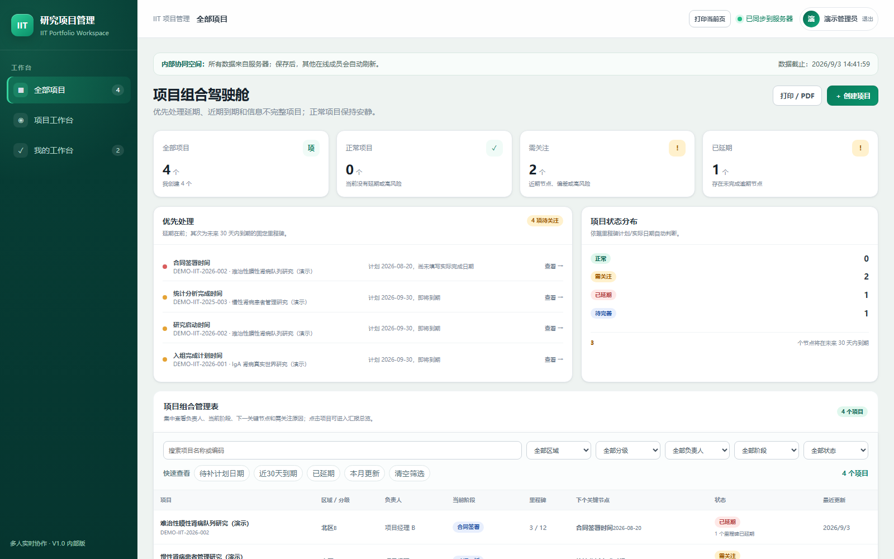
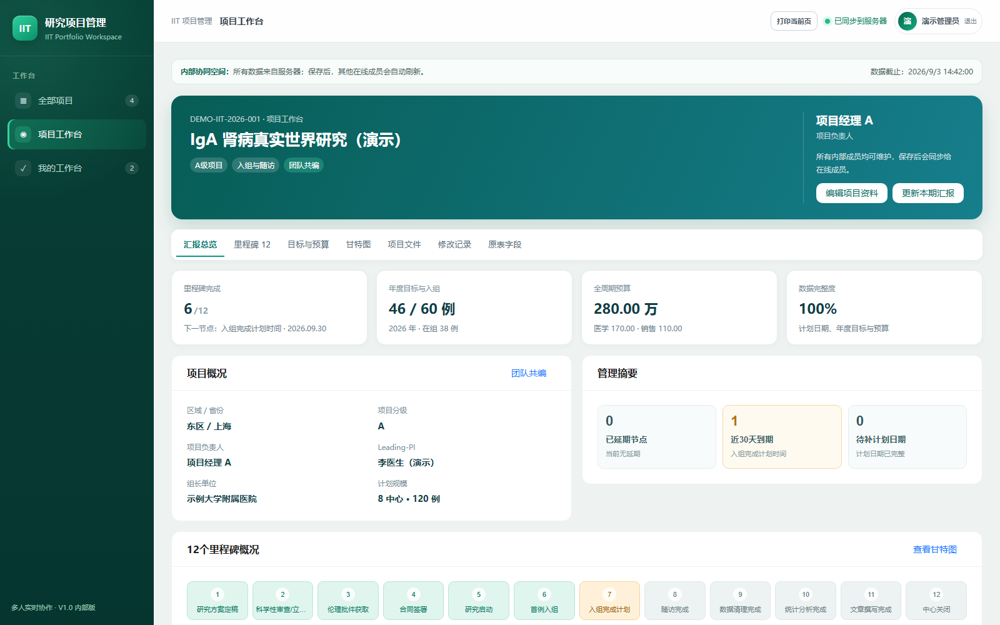
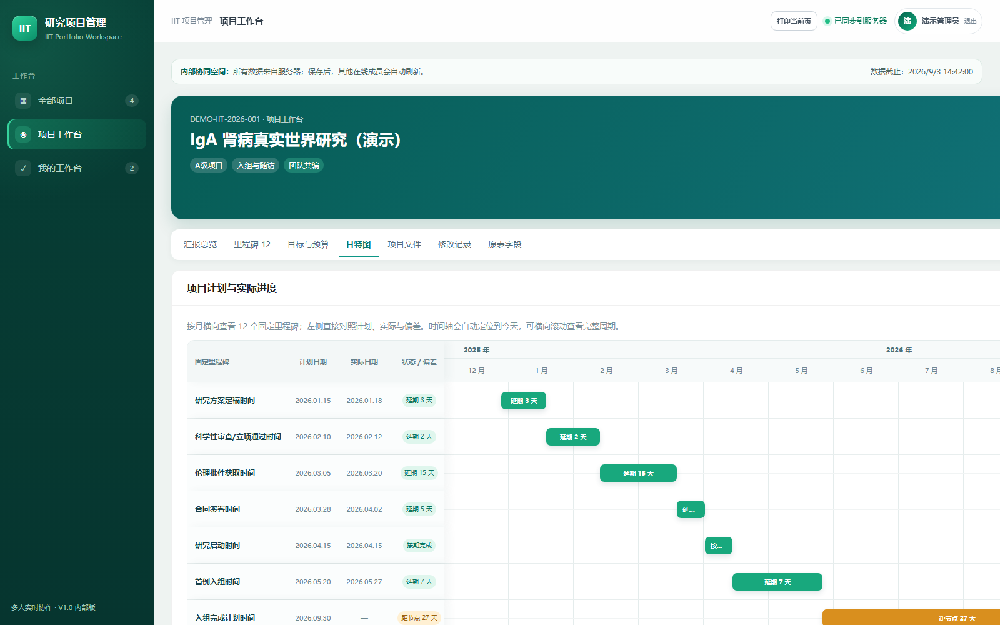
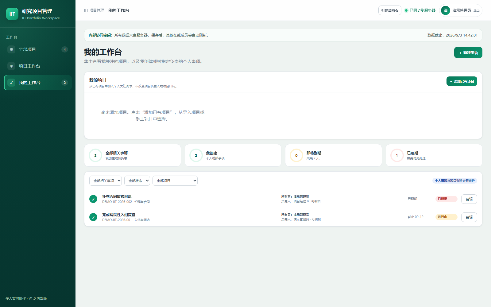
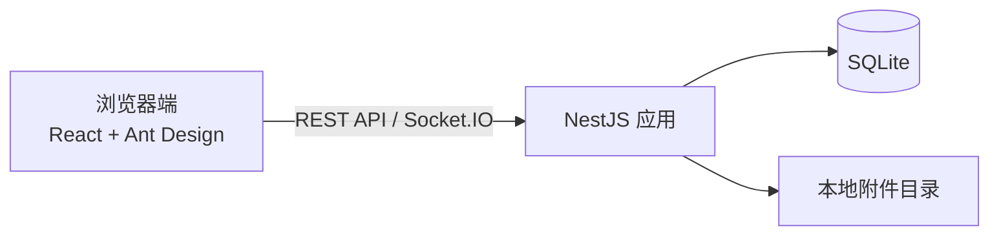

# IIT Portfolio Workspace

> 面向小型 IIT 临床研究团队的轻量级项目组合管理工具。以“少填报、状态可信、汇报时一眼看出问题”为设计目标。



## 项目介绍

当多个 IIT 项目分散在 Excel 中维护时，项目经理很难同时保证口径一致、进度及时和汇报清晰。本项目将原有台账的主要字段和填报习惯迁移到浏览器，并围绕 12 个固定研究里程碑，生成组合看板、项目汇报和甘特图。

适用于约 5 人的内部团队，采用单服务器 + SQLite 的简洁部署方案。它是项目进度协作工具，不是 EDC、CTMS 或临床数据采集系统。

## 核心能力

- 项目组合驾驶舱：集中查看状态、负责人、区域、分级、下一关键节点与需关注原因。
- 12 个固定里程碑：只需维护计划日期和实际日期，自动判断已完成、进行中、待开始与延期。
- 单项目工作台：展示入组目标、年度预算、本期汇报、附件和修改记录。
- 时间可视化：甘特图同时展示计划、实际和偏差，使用颜色区分状态。
- 轻量协作：所有成员共同维护项目资料，Socket.IO 通知 + 5 秒轻量轮询保证页面及时刷新。
- 表格迁移：支持按现有模板导入 Excel，降低从原始台账迁移的成本。

## 界面预览

| 单项目汇报 | 12 里程碑甘特图 |
| --- | --- |
|  |  |

| 个人工作台 |
| --- |
|  |

> 截图和演示数据均为专门生成的虚构内容，不对应任何真实研究、医疗机构或人员。

## 技术架构



详细边界和数据流见 [架构说明](docs/architecture.md)。

## 本地运行

环境要求：Node.js 24（或兼容的当前 LTS）、pnpm 11。

```bash
corepack enable
pnpm install
cp .env.example .env
pnpm dev
```

Windows PowerShell 复制配置文件：

```powershell
Copy-Item .env.example .env
pnpm dev
```

打开 `http://localhost:5173`，输入显示姓名和 `.env` 中配置的内部共享密码。请勿将真实 `.env` 提交到仓库。

如需生成两个可用于截图和体验的虚构项目，保持服务运行并在另一个终端执行 `pnpm demo:seed`。详见 [演示数据说明](docs/demo-data.md)。

## 验证

```bash
pnpm build
pnpm test
```

## 部署

项目提供适合 Ubuntu 单机部署的简化脚本，包含 systemd 服务、Caddy 反向代理和 SQLite 备份定时器。见 [简化部署说明](deploy-simple/README.md)。

## 安全与数据边界

- 公开仓库只允许虚构数据，不得提交真实研究信息、人员姓名、数据库、Excel、附件或服务器配置。
- 共享密码模式仅面向可信任的小型内部团队，不代替企业级身份管理。
- 对公网开放前应配置 HTTPS、访问控制、强密码和定期备份。

漏洞报告方式见 [SECURITY.md](SECURITY.md)，贡献约定见 [CONTRIBUTING.md](CONTRIBUTING.md)。

## 开源许可

本项目采用 [MIT License](LICENSE)，允许查看、下载、修改、商用和再发布，但需保留原许可证和版权声明。
